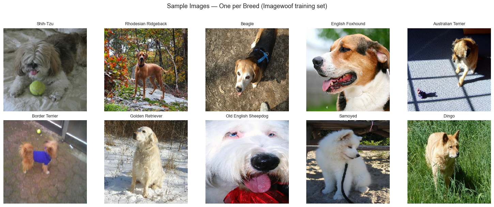
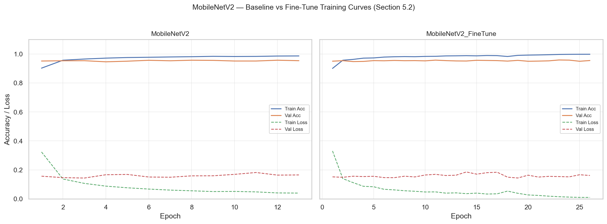
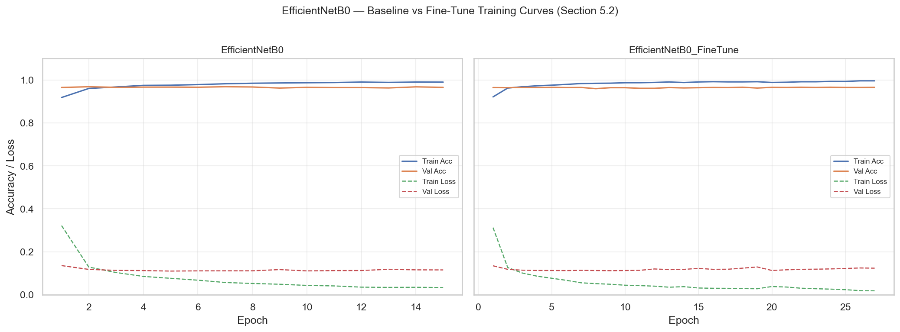
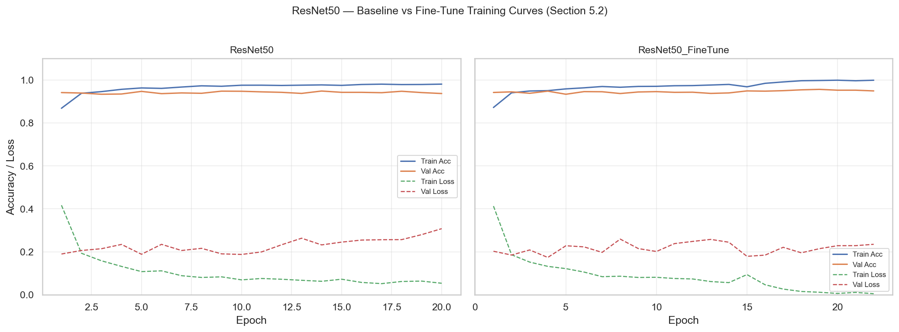
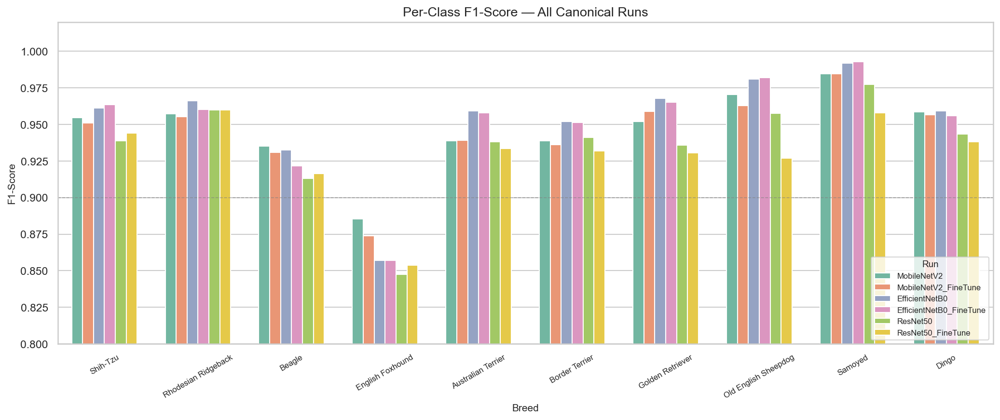
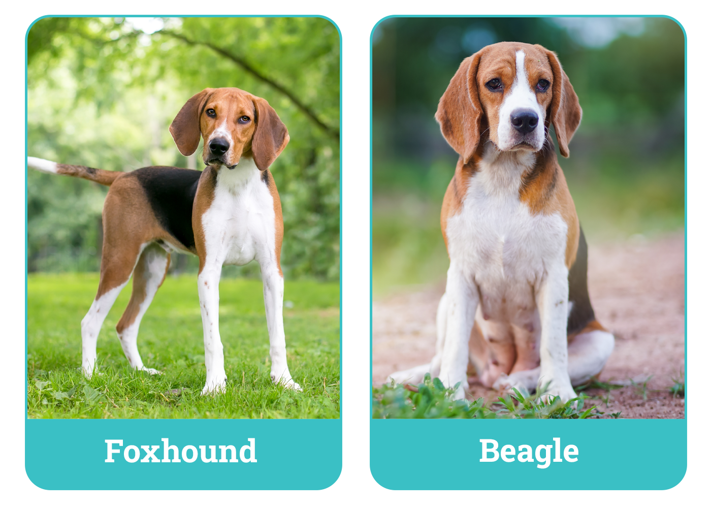
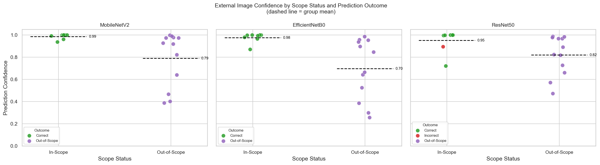

# Training and Evaluation of a 10-Class Dog Breed Classifier Using Imagewoof

**Guilherme Sonego Neto**

Dundalk Institute of Technology

In partial fulfilment of the requirements for the degree of  
Postgraduate Diploma in Applied Data Science

May 2026

School of Informatics and Creative Arts  
Supervisor(s):  
Muhammad Adil Raja  
Jack Mc Donnell

## Abstract

This project investigates how transfer learning can be used to develop and evaluate a machine-learning pipeline for classifying 10 dog breeds using Imagewoof. It is an applied data analytics study combining data preparation, TensorFlow/Keras model development, comparative experimentation, and result interpretation in a reproducible notebook-based workflow.

Imagewoof is a challenging 10-class subset of ImageNet containing visually similar dog breeds, making it suitable for a fine-grained classification study. The project compares transfer-learning strategies using pre-trained models and evaluates them with accuracy, precision, recall, F1-score, confusion matrices, and training curves. Six experiment runs were completed: feature extraction and fine-tuning passes for MobileNetV2, EfficientNetB0, and ResNet50. EfficientNetB0 under feature extraction achieved the strongest held-out performance with test accuracy of 0.9578, while MobileNetV2 achieved 0.9509 and ResNet50 achieved 0.9397. Fine-tuning did not consistently improve over the feature-extraction baselines for any of the three architectures, with the feature-extraction strategy producing the strongest results in this comparison.

A small external image set was used as a secondary evaluation layer to examine generalisation beyond the core dataset. All three architectures produced distributed predictions across multiple breed classes on out-of-scope images. While the MobileNetV2 baseline and EfficientNetB0_FineTune achieved an in-scope external accuracy of 1.00 (8/8 correct), ResNet50 correctly predicted 7/8 (0.875) external validation images (mean in-scope confidence 0.9512, out-of-scope mean confidence 0.8211). The external evaluation shows how the trained models behave on images outside the core dataset, while primary generalisation performance is measured using the held-out Imagewoof validation set.

## Table of Contents

- [Section 1: Background / Introduction](#section-1-background--introduction)
- [Section 2: Literature Review](#section-2-literature-review)
- [Section 3: Exploration of Data and Methods](#section-3-exploration-of-data-and-methods)
- [Section 4: Results and Discussion](#section-4-results-and-discussion)
- [Section 5: Final Design and Implementation of Modelling](#section-5-final-design-and-implementation-of-modelling)
- [Section 6: Conclusion and Future Work](#section-6-conclusion-and-future-work)
- [References](#references)
- [Section 7: Appendix](#section-7-appendix)

## Section 1: Background / Introduction

### Introduction

Deep learning has transformed image classification by enabling convolutional neural networks to learn useful visual features from large labelled datasets. In practice, transfer learning is especially valuable because it allows pre-trained models to be adapted to narrower tasks without training a model from scratch. This is particularly relevant in an academic dissertation where the objective is not only to achieve good predictive performance, but also to document a clear and reproducible workflow.

This study focuses on dog breed classification using Imagewoof, a challenging 10-class subset derived from ImageNet. The project develops a machine-learning pipeline for loading, preprocessing, training, and evaluating image data, and uses that pipeline to compare a small set of TensorFlow/Keras transfer-learning models on the Imagewoof task. The practical component is organised through a Python notebook so that the workflow, outputs, and model comparisons can be documented consistently.

The study also recognises that strong in-dataset results do not automatically imply strong performance in more varied conditions. For that reason, a small external image set is used as a secondary evaluation layer. These images are not used for training, but to support discussion of generalisation, model behaviour, and the limitations of closed-set classifiers when inputs differ from the main dataset.

The project centres on comparing transfer-learning models for a 10-breed classification problem, prioritising reproducible methods and evidence-based evaluation.

### Research Questions

This project is guided by two primary research questions:

**RQ1 - Training Pipeline Design**  
How can a machine learning pipeline be developed to classify 10 dog breeds using the Imagewoof dataset?

This question focuses on the practical engineering and analytics workflow. It addresses dataset handling, preprocessing, model training, evaluation, reproducibility, and the design of a notebook workflow for repeatable experimentation and interpretation.

**RQ2 - Comparative Model Training**  
Which transfer learning strategy delivers the best overall performance for classifying 10 dog breeds using the Imagewoof dataset?

This question focuses on comparative modelling. It investigates how different pre-trained architectures and training strategies, such as feature extraction and fine-tuning, affect classification performance, generalisation, and the trade-off between model quality and implementation complexity.

Together, these research questions shift the focus from analysing a fixed classifier to building, training, and evaluating a reproducible image classification workflow.

### Problem Definition

Developing a machine learning pipeline capable of classifying 10 visually similar dog breeds from image data using the Imagewoof dataset presents a fine-grained classification challenge. This is a fine-grained image classification problem, because the breeds in Imagewoof are visually similar and therefore harder to distinguish than broader object categories.

The core problem here is not how to wrap a fixed model in a reliability layer, but how to design a clear, reproducible, and evidence-based training pipeline for the defined 10-breed task. The work therefore demonstrates:

- a reproducible end-to-end pipeline for loading, preprocessing, training, and evaluating image data
- a justified comparison of selected TensorFlow/Keras model architectures
- a clear explanation of training strategies such as feature extraction and fine-tuning
- evidence-based evaluation using appropriate classification metrics and visual analysis

An additional practical challenge is that performance on the main dataset may not fully represent behaviour on more varied real-world images. For that reason, the experiments also include a small external image evaluation as a secondary strand, allowing discussion of generalisation limits without replacing the main Imagewoof-based experiment.

### Project Relevance in the field of Data Analytics

The relevance to applied data analytics lies in building and evaluating a practical image-classification workflow from end to end. Rather than treating model training as an isolated coding exercise, the work is approached as a real analytics task where data preparation, model development, experiment comparison, and interpretation are handled in a structured way.

Applied data analytics is reflected throughout the methodology via:

- structured preparation of an image dataset for machine learning
- use of TensorFlow/Keras transfer learning for practical model development
- comparative evaluation using quantitative metrics such as accuracy, precision, recall, F1-score, and confusion matrices
- visual analysis of training history, class-level errors, and model behaviour on external images

By combining model training, evaluation, error analysis, and discussion of generalisation, the workflow shows how applied data analytics supports the development of usable machine learning systems rather than only producing a single accuracy score.

### Core Technology, Architecture and Research processes

The core implementation rests on a practical TensorFlow/Keras workflow for classifying 10 dog breeds from the Imagewoof dataset. Instead of relying on one fixed classifier, the experiments compare a small number of pre-trained approaches to examine how different training strategies affect performance.

#### Core Technology

The implementation relies on the following technologies:

- Python as the primary programming language
- TensorFlow / Keras for transfer learning, model training, and fine-tuning
- Jupyter Notebook for the practical hands-on workflow and experiment documentation
- NumPy and Pandas for data handling and result aggregation
- Matplotlib and Seaborn for visualisation of training curves, confusion matrices, and comparative results
- scikit-learn utilities for evaluation metrics and reporting where appropriate

The final comparison in this study uses MobileNetV2, EfficientNetB0, and ResNet50 (feature extraction and fine-tuning variants for each architecture).

#### System Architecture

The overall workflow is organised into a few clear stages:

1. **Data preparation**  
   Load the Imagewoof images and organise the training, validation, and test data.
2. **Preprocessing**  
   Resize and normalise the images so they can be used by the selected models.
3. **Model training**  
   Train and compare the selected transfer-learning models.
4. **Evaluation**  
   Measure performance using standard classification metrics and visual outputs.
5. **External-image testing**  
   Use the curated `external_images` set as a secondary evaluation step.

This structure keeps the workflow practical, explicit, and reproducible.

#### Research Process

The research process follows a structured but practical workflow:

1. Prepare the Imagewoof dataset and confirm the data split strategy.
2. Build a reusable notebook workflow for loading, preprocessing, training, and evaluation.
3. Train selected transfer-learning models under an initial feature-extraction setup.
4. Run fine-tuning experiments on the strongest candidate models.
5. Compare the models using consistent evaluation metrics and visualisations.
6. Evaluate the selected models on the `external_images` set.
7. Interpret the results in relation to the research questions and the empirical findings.

All experiments are designed to be reproducible, with outputs exported programmatically (for example training history tables, classification reports, confusion matrices, and external-evaluation result files).

### Hypothesis for a Solution

This project is based on the hypothesis that transfer learning can be used to develop a usable classifier for 10 dog breeds using the Imagewoof dataset.

This hypothesis assumes that pre-trained models provide a strong starting point for this classification task and that a structured comparison of transfer-learning strategies will help identify a practical, evidence-based approach for the task.

### Structure of the report

**Section 1 - Background / Introduction**  
This section introduces the project context, presents the research questions, defines the problem, explains the relevance of the work in applied data analytics, and outlines the core workflow and hypothesis.

**Section 2 - Literature Review**  
This section reviews relevant literature on transfer learning, convolutional neural networks, fine-grained image classification, and evaluation of classification performance. It also positions the project within the current research landscape.

**Section 3 - Exploration of Data and Methods**  
This section describes the Imagewoof dataset, the external image set, data preparation, preprocessing, and the practical workflow used to train and evaluate the selected models.

**Section 4 - Results and Discussion**  
This section presents the baseline results, evaluation strategy, external-image analysis, and reporting outputs used to interpret the dissertation findings.

## Section 2: Literature Review

Modern image classification is dominated by convolutional neural networks (CNNs) trained on large labelled datasets. The release of ImageNet provided a major foundation for this progress by offering a large-scale benchmark for visual recognition tasks (Deng et al., 2009). The ImageNet Large Scale Visual Recognition Challenge (ILSVRC) further accelerated the field by encouraging systematic comparison of model performance across different architectures (Russakovsky et al., 2015). As a result, CNNs pre-trained on ImageNet became a standard starting point for many practical computer vision tasks.

Transfer learning is especially important in this context because it allows knowledge learned from large datasets to be reused for more focused classification problems. Yosinski et al. (2014) showed that features learned by deep neural networks can transfer effectively across related tasks, particularly when lower-level visual patterns remain useful. This is directly relevant to the present project, which uses Imagewoof as a focused 10-class dataset and investigates which transfer-learning strategy provides the strongest practical performance.

Imagewoof is well-suited for this study because it poses a fine-grained classification problem. The visual differences between the 10 dog breeds are often subtle, relying on specific fur patterns, ear shapes, or facial structures. Fine-grained tasks like this are also highly sensitive to pose variation and background clutter, making them much harder than general object recognition (Shorten and Khoshgoftaar, 2019). Because the classes are so similar, Imagewoof provides a strict test of how well different transfer-learning approaches actually perform when the classification boundaries are narrow.

In comparing these approaches, the choice of base architecture is critical. MobileNetV2 was specifically designed to be lightweight, using inverted residuals and linear bottlenecks for efficient performance (Howard et al., 2017). ResNet50 provides a heavier, traditional baseline that solved earlier vanishing-gradient issues using residual skip connections (He et al., 2016). EfficientNet, meanwhile, balances depth, width, and resolution through compound scaling to improve accuracy without the compute demands of older, deeper models (Tan and Le, 2019). Testing these three architectures together shows how very different network designs handle the same fine-grained problem.

Existing research also shows that transfer learning is not a single fixed method. Performance can depend on decisions such as model choice, feature extraction, and fine-tuning. This makes comparative experimentation an important part of applied machine learning, particularly in academic work where the goal is not only to obtain a result, but also to justify the process used to obtain it. For this reason, the literature supports a study design that compares a small number of pre-trained models and training strategies under consistent evaluation conditions. Fine-tuning an entire architecture frequently carries the risk of overfitting, especially when the target dataset is relatively small compared to the parameter count of the model.

Evaluation is another important theme in the literature. Although classification accuracy is a useful summary metric, it is not sufficient on its own to explain model behaviour. Class-level precision, recall, F1-score, confusion matrices, and visual analysis are commonly used to provide a fuller picture of performance. This broader evaluation perspective is important for a practical study such as this one, where the aim is to develop not only a high-performing model but also a well-documented, evidence-based workflow.

Literature on calibration and confidence remains relevant as a secondary consideration. Guo et al. (2017) showed that modern neural networks are often poorly calibrated, meaning predicted probabilities do not always reflect true correctness. Hendrycks and Gimpel (2017) further demonstrated that softmax confidence can still provide some insight into model behaviour. In this study, these ideas are not the main research focus, but they remain useful when discussing external-image results and the limitations of closed-set classifiers.

Overall, the literature supports three key ideas for this study: CNN-based transfer learning is an effective foundation for image classification, fine-grained tasks such as dog-breed recognition benefit from structured model comparison, and evaluation should extend beyond a single headline metric. These findings provide the basis for a practical training-and-evaluation study using the Imagewoof dataset.

### Limitations of existing solutions

Although CNNs and transfer learning have achieved strong benchmark performance, many studies place greater emphasis on final accuracy than on presenting a concise and reproducible comparison of training strategies for a narrowly scoped applied problem. For this project, this creates a practical gap: the work must not only apply existing methods but also explain clearly how methods were selected, implemented, and evaluated.

There is also a gap between reporting strong results on a core dataset and discussing how a model behaves on more varied images. Research on calibration and confidence remains relevant here (Guo et al., 2017; Hendrycks and Gimpel, 2017), because even well-performing classifiers may behave less reliably when data differs from the training distribution.

This project addresses these gaps by developing a notebook-based workflow, comparing selected transfer-learning strategies on Imagewoof, and using a small external image set to support discussion of practical model behaviour without shifting the study away from its main classification task.

## Section 3: Exploration of Data and Methods

### Data Collection and Methods of Data Collection

The primary dataset used in this project is Imagewoof, a subset of ImageNet containing images from 10 visually similar dog breeds. Imagewoof was created as a more challenging classification subset by selecting dog classes that are difficult to distinguish, making it suitable for a fine-grained transfer-learning study.

In the current project direction, the Imagewoof images are used as the main dataset for model training and evaluation. The practical workflow uses the available dataset structure to support reproducible train, validation, and test handling within the TensorFlow notebook. This makes it possible to compare models under consistent experimental conditions.

In addition to the main dataset, a small external collection of dog images is retained to support secondary evaluation. These images are not used for training. Instead, they provide a small observational check on how the final trained model behaves when images differ in pose, background, framing, or breed scope from the main dataset.

All datasets are stored locally and accessed programmatically. No automated scraping or large-scale new data acquisition is required for the project.

### Procedure of Ethical Approval

This project does not involve human participants, personal data, or sensitive information. The primary dataset, Imagewoof, is a publicly available subset of ImageNet and contains labelled images of dog breeds. These images are widely used for academic research and do not contain personally identifiable information.

In addition to the Imagewoof dataset, a small external set of dog images is used to strengthen evaluation by providing a simple comparison under slightly varied visual conditions. These external images are sourced from Wikimedia Commons and are selected under the following constraints:

- Only images released under Public Domain or permissive Creative Commons licences are used.
- No identifiable individuals appear in the images.
- The dog is the primary subject of the image.

The external images are used strictly for local evaluation purposes and are not redistributed. Each image source, licence type, and access date is documented in the Appendix to ensure transparency and proper attribution.

Given that the project does not involve human subjects, personal data processing, behavioural studies, or data collection from individuals, formal ethical approval was not required under DkIT research guidelines. However, care has been taken to ensure responsible use of publicly available data and compliance with licensing requirements.

### Data Description

Imagewoof contains 10 dog-breed classes in a standard class-per-directory layout, which is compatible with TensorFlow/Keras image-loading pipelines.

_Figure 1: Representative sample images from each of the 10 Imagewoof dog breed classes._

In this study, Imagewoof is used as the core dataset for model training and evaluation. The notebook workflow applies a reproducible approach to training, validation, and final testing so that model comparison remains consistent across experiments.

In addition to the main dataset, a small external dataset assembled from Wikimedia Commons is used to simulate slightly more varied real-world conditions. This external set contains both in-scope and out-of-scope dog images and is intentionally limited in size. Its purpose is to support discussion of model behaviour outside the core dataset rather than provide a statistically representative benchmark.

All images are processed into the input format required by the selected TensorFlow models, including resizing and ImageNet-style normalisation. No data augmentation is used in this phase to preserve a controlled comparison between architectures and training strategies; this keeps interpretation of performance differences attributable primarily to model and training choices. Imagewoof already contains substantial natural variation in pose, lighting, framing, and background conditions, making it suitable for controlled experimentation without introducing additional augmentation variables.

### Data Cleaning and Exploration

As Imagewoof is a publicly curated dataset derived from ImageNet, extensive cleaning is not required. However, the workflow still requires careful preparation to ensure compatibility with the TensorFlow pipeline. Directory structures, label mappings, and image loading are verified programmatically before training.

Validation and test handling are created using a reproducible rule so that all model comparisons remain consistent. This is important because the study compares training strategies rather than presenting a single one-off model result.

For the external Wikimedia Commons dataset, additional manual validation was required during image selection. Each image was reviewed to confirm that:

- The dog is the primary subject.
- The image licence is Public Domain or permissive Creative Commons.
- No identifiable individuals are present.
- The image clearly belongs either to one of the 10 in-scope breeds or to an out-of-scope breed.

Images that did not meet these criteria were excluded prior to evaluation. The final external set consists of 20 images, divided into 8 in-scope and 12 out-of-scope examples. It is important to emphasize that the primary generalisation evaluation in this project comes from the held-out Imagewoof validation set, which contains several thousand unseen images. Because the Wikimedia Commons set is intentionally small and not class-balanced, it should be interpreted strictly as a supplementary observational evaluation rather than the primary measure of model generalisation.

No relabelling, augmentation, or manual image modification is used. Apart from the standard preprocessing required by the chosen TensorFlow models, all images are evaluated in their original form.

### Data Visualisation

Data visualisation in this project is used to critically compare trained models and identify specific patterns in classification behaviour. Rather than relying solely on aggregate metrics, visual outputs help to diagnose where and why an architecture succeeds or fails.

The main visual analyses include:

- **Training and validation loss/accuracy curves:** These are used to identify convergence behaviour and detect potential overfitting during the training process. They provide early indications of whether a model has stabilized or if fine-tuning is destabilizing the weights.
- **Confusion matrices:** These matrices help to visualize class-level error distribution. Specifically, they reveal whether misclassifications are evenly spread across the dataset or if they are localized to specific visually similar breed pairs, which is a common failure mode in fine-grained tasks.
- **Class-level comparison charts (Per-class Recall):** These charts expose imbalance-related weaknesses. Even when overall accuracy is high, they can highlight specific breeds that the models consistently struggle to recognize due to either visual ambiguity or dataset representation.
- **Comparative metric tables:** Summarising results across architectures and training strategies provides a structured way to observe performance trade-offs directly.
- **Selected examples from the external image evaluation:** These visually demonstrate real-world generalization constraints by showing model behavior and confidence on both in-scope and out-of-scope images.

### Preliminary Analysis

At this stage, baseline model training experiments had already been completed. Initial baseline experiments were run locally using TensorFlow/Keras under a feature-extraction setup. These runs used the Imagewoof training directory with a deterministic internal training/validation split and evaluated the resulting models on the held-out Imagewoof `val` directory.

At this stage, two baseline models were executed as initial feature-extraction pilots in a CPU-only Windows environment. Following these successful pilots, final training for all six experiments utilized hardware acceleration (NVIDIA RTX 3060), which significantly reduced epoch training times. This computational shift highlighted an additional benefit of transfer learning: reusing pretrained layers is computationally economical compared to training a deep network entirely from scratch. These final GPU-accelerated runs produced the following headline baseline results:

- **MobileNetV2:** best validation accuracy **0.9568**, held-out test accuracy **0.9509**
- **EfficientNetB0:** best validation accuracy **0.9684**, held-out test accuracy **0.9578**
- **ResNet50:** best validation accuracy **0.9485**, held-out test accuracy **0.9397**

These baseline outputs were exported as reproducibility artifacts, including `history.csv`, `classification_report.csv`, and `confusion_matrix.npy` for each run.

The gap between the best validation accuracy and the held-out test accuracy is small (approximately 0.006–0.011 percentage points) and broadly consistent across all three architectures, which suggests that the internal training/validation split is representative of the held-out distribution. Early class-level results also show uneven performance, with some breeds performing better than others in the first baseline runs.

These findings make the comparative study more meaningful rather than less. They indicate that:

- a single architecture should not be assumed to generalise well across all breeds
- internal validation performance alone may overstate real performance on the held-out set
- additional comparison across architectures and fine-tuning strategies is necessary

These preliminary results provide concrete evidence for the selected study direction and establish baselines for subsequent comparisons.

## Section 4: Results and Discussion

### 1. Model Training Experiments (RQ2)

The project compares a small number of TensorFlow/Keras transfer-learning models on the Imagewoof task. Baseline feature-extraction runs have been completed for:

- MobileNetV2
- EfficientNetB0
- ResNet50

Fine-tuning passes were completed for all three architectures by unfreezing selected upper layers and retraining with a lower learning rate. The detailed strategy comparison is reported in Section 5.2 and Table 1.

### 2. Structured Evaluation on Imagewoof (RQ1 & RQ2)

Each experiment was evaluated using accuracy, precision, recall, F1-score (macro and weighted), confusion matrices, per-class error patterns, and training and validation curves. Across all six runs, held-out test accuracy ranged from 0.9374 to 0.9578, with macro F1 ranging from 0.9330 to 0.9529. Training curves showed that all runs converged within the 100-epoch cap through early stopping, with actual epoch counts ranging from 13 to 27 across head and fine-tune phases. Confusion matrices revealed localised misclassification patterns rather than systematic failures, with English Foxhound appearing as the most consistent error source across all architectures.

### 3. External Image Evaluation (RQ2)

The existing 20-image Wikimedia Commons dataset stored in `external_images` was retained as a secondary evaluation set. External-image behaviour was interpreted alongside the main Imagewoof results. The analysis includes:

- Running the selected models on all 20 images
- Separating outcomes into in-scope and out-of-scope subsets
- Recording predictions and confidence values
- Identifying notable errors and overconfident mistakes

MobileNetV2, EfficientNetB0, and ResNet50 were evaluated on the full 20-image set using the same preprocessing pipeline as the main evaluation. Outcomes were separated into in-scope and out-of-scope subsets, and predictions and confidence scores were recorded for each image. Full quantitative findings are reported in Section 5.4.

### 4. Additional Visualisation and Reporting (RQ1 & RQ2)

Training and validation loss/accuracy curves support the convergence summary above, with validation loss tracking training loss closely throughout the head phase. Confusion matrices visualise per-class error distribution and show that misclassifications are localised to visually similar breed pairs rather than reflecting systematic failures. Comparative results tables summarise accuracy and F1 across all six runs. Per-class F1 analysis shows that English Foxhound is the weakest class across all three architectures, aligning with its lower training sample count in the dataset.

## Section 5: Final Design and Implementation of Modelling

This section presents the final modelling design, implementation choices, and comparative results for the 10-breed classification task.

### 5.1 Additional prototypes

The current comparison includes:

- MobileNetV2
- EfficientNetB0
- ResNet50

Completed baseline and fine-tuning runs are reported for all three architectures. The purpose of this section is to compare predictive performance, training behaviour, and implementation practicality.

Each run produced reproducibility artifacts (training history, classification report, confusion matrix, and model file) that were used to generate the comparative analysis presented in this section.

### 5.2 Hyper Parameter Tuning, Evaluation and Testing

The experiment setup used in this study was:

- image size: 224 x 224
- batch size: 16
- deterministic training/validation split from `imagewoof\\train`
- held-out test evaluation using `imagewoof\\val`
- head-training learning rate: 1e-3
- fine-tuning learning rate: 1e-5
- feature extraction followed by selective fine-tuning

This section reports:

- training and validation curves
- test-set metrics
- confusion matrices
- class-level error analysis
- comparative model tables
- external-image evaluation findings

The following values correspond to the feature-extraction baselines (training stopped by early stopping; actual epoch counts are recorded in `results/<run>/history.csv`):

- **MobileNetV2**
  - Training strategy: feature extraction
  - Best validation accuracy: 0.9568
  - Held-out test accuracy: 0.9509
- **EfficientNetB0**
  - Training strategy: feature extraction
  - Best validation accuracy: 0.9684
  - Held-out test accuracy: 0.9578
- **ResNet50**
  - Training strategy: feature extraction
  - Best validation accuracy: 0.9485
  - Held-out test accuracy: 0.9397

These results show that all three feature-extraction baselines reached strong held-out performance. The gap between best validation accuracy and held-out test accuracy is small across all models (0.006–0.011 percentage points), suggesting that the internal split is representative of the held-out distribution. EfficientNetB0 provides the strongest feature-extraction result, followed by MobileNetV2 and ResNet50.

Early stopping triggered in all six runs, with actual epoch counts ranging from 13 to 27 across head and fine-tune phases. This confirms that the 100-epoch cap was never a binding constraint and that convergence was reliably detected before the maximum was reached, supporting the reproducibility of the training configuration.

Table 1 summarises the strategy comparison across the six completed runs. To provide context for these results, Table 2 documents the respective model complexity, detailing the architectural philosophy and parameter count for each tested model.

**Table 1: Strategy Comparison**

| Run                     | Strategy           | Best val. accuracy | Test accuracy |   Macro F1 | Weighted F1 |
| ----------------------- | ------------------ | -----------------: | ------------: | ---------: | ----------: |
| MobileNetV2             | Feature extraction |             0.9568 |        0.9509 |     0.9476 |      0.9508 |
| MobileNetV2_FineTune    | Fine-tuning        |             0.9584 |        0.9486 |     0.9450 |      0.9485 |
| EfficientNetB0          | Feature extraction |         **0.9684** |    **0.9578** | **0.9529** |  **0.9576** |
| EfficientNetB0_FineTune | Fine-tuning        |             0.9662 |        0.9555 |     0.9508 |      0.9554 |
| ResNet50                | Feature extraction |             0.9485 |        0.9397 |     0.9353 |      0.9396 |
| ResNet50_FineTune       | Fine-tuning        |             0.9568 |        0.9374 |     0.9330 |      0.9374 |

Source: Values were derived from the `accuracy`, `macro avg`, and `weighted avg` rows in the classification reports and the best `val_accuracy` from training histories for all six runs.

**Table 2: Model Complexity Comparison**

| Architecture   | Parameters | Training Strategy | Architectural Focus                  |
| -------------- | ---------: | ----------------- | ------------------------------------ |
| MobileNetV2    |      ~3.5M | Lightweight       | Optimized for mobile/edge efficiency |
| EfficientNetB0 |      ~5.3M | Balanced          | Compound scaling (depth/width/res)   |
| ResNet50       |     ~25.6M | Deep Traditional  | Heavy residual skip connections      |

Source: Extracted from Keras model architecture summaries prior to parameter unfreezing.

_Figure 1,2,3: Training and validation accuracy curves across all six runs, illustrating convergence behaviour and the effect of early stopping._

Fine-tuning results were mixed across architectures. For MobileNetV2, fine-tuning reduced test accuracy from 0.9509 to 0.9486 and slightly reduced both macro and weighted F1. For EfficientNetB0, fine-tuning produced comparable test accuracy (0.9555 versus 0.9578 for feature extraction) with similar F1. For ResNet50, fine-tuning reduced test accuracy from 0.9397 to 0.9374.

The failure of fine-tuning to consistently improve accuracy can be attributed to several factors. Lower-level features extracted from ImageNet are already highly transferable to fine-grained visual classification tasks, leaving limited room for improvement without substantially larger datasets. In addition, Imagewoof remains relatively small compared to the parameter count of deep CNN architectures, increasing the risk of overfitting when large numbers of layers are unfrozen. Fine-tuning is also highly sensitive to hyperparameter selection, particularly learning-rate scheduling, meaning consistent gains cannot be guaranteed without substantially more experimentation.

This is an important finding for RQ2. It shows that transfer learning strategy affects final performance, but greater training complexity does not automatically lead to better results. Under this in-dataset evaluation setting, the strongest overall result was feature extraction with EfficientNetB0; however, Section 5.4 shows that both strategies showed equivalent external behaviour and should be considered alongside internal metrics.

### 5.3 Class-wise Failure Analysis

Table 3 reports per-class recall for the three feature-extraction baselines. Recall is the primary lens because it directly captures how many true instances of each breed the model correctly identified, making class-level weaknesses visible even when aggregate accuracy is high.

**Table 3: Per-class Recall Comparison**

| Breed Name           | MobileNetV2 | EfficientNetB0 | ResNet50 |
| -------------------- | ----------: | -------------: | -------: |
| Shih-Tzu             |      0.9487 |         0.9707 |   0.9389 |
| Rhodesian Ridgeback  |      0.9632 |         0.9804 |   0.9657 |
| Beagle               |      0.9498 |         0.9426 |   0.9163 |
| English Foxhound     |      0.8616 |         0.8304 |   0.8304 |
| Australian Terrier   |      0.9776 |         0.9676 |   0.9451 |
| Border Terrier       |      0.9066 |         0.9287 |   0.9238 |
| Golden Retriever     |      0.9651 |         0.9776 |   0.9651 |
| Old English Sheepdog |      0.9763 |         0.9787 |   0.9668 |
| Samoyed              |      0.9837 |         0.9907 |   0.9604 |
| Dingo                |      0.9341 |         0.9512 |   0.9341 |

Source: Per-class recall values were extracted from the saved classification reports for all three feature-extraction runs.

_Figure 2: Per-class F1 score comparison across all three feature-extraction baseline models._

All 10 classes reached functional recall levels across all three models, with values ranging from 0.830 to 0.991. **English Foxhound** is consistently the weakest class across all three architectures (MobileNetV2: 0.8616, EfficientNetB0: 0.8304, ResNet50: 0.8304), which aligns with it having approximately 40% fewer training samples than most other breeds (~464 training images versus ~750 for the majority), making it the primary class-imbalance case in the dataset. Border Terrier also shows consistently lower recall across all architectures (MobileNetV2: 0.9066, EfficientNetB0: 0.9287, ResNet50: 0.9238), suggesting some shared visual ambiguity with adjacent breeds.

_Figure 3: Example visual similarity between Beagle and English Foxhound breeds, illustrating a likely source of recurring misclassification across models. Credit: Left – Mary Swift, Shutterstock | Right – kobkik, Shutterstock_

The strongest performers across all three architectures are Samoyed (MobileNetV2: 0.9837, EfficientNetB0: 0.9907, ResNet50: 0.9604), Old English Sheepdog (MobileNetV2: 0.9763, EfficientNetB0: 0.9787, ResNet50: 0.9668), and Rhodesian Ridgeback (MobileNetV2: 0.9632, EfficientNetB0: 0.9804, ResNet50: 0.9657). For RQ2, the per-class comparison reinforces that the aggregate test accuracy is a reliable summary: class-level quality is broadly consistent across all feature-extraction models, and the comparison does not reveal any class-collapse failures. Strategy differences should therefore be interpreted through the small but consistent numeric gaps rather than qualitative failure modes.

_Figure 4: Confusion matrices for all six runs, showing localised misclassification patterns concentrated around English Foxhound and Border Terrier._

### 5.4 External Image Evaluation

All three selected models — MobileNetV2 (feature extraction), EfficientNetB0_FineTune, and ResNet50 (feature extraction) — were evaluated on a secondary 20-image dataset drawn from Wikimedia Commons (8 in-scope, 12 out-of-scope). As stated previously, primary generalisation is evaluated on the large Imagewoof held-out test set; this 20-image secondary check is supplementary and observational. While MobileNetV2 and EfficientNetB0_FineTune achieved **1.00 in-scope external accuracy** (8/8 correct), ResNet50 achieved **0.875 in-scope external accuracy** (7/8 correct).

On out-of-scope images, mean prediction confidence was 0.79 for MobileNetV2, 0.75 for EfficientNetB0_FineTune, and 0.82 for ResNet50. This indicates that the models assigned more uncertain, distributed predictions to images outside the training distribution. In-scope predictions were substantially more confident, with mean confidence of 0.986, 0.985, and 0.951 respectively. On this small sample, the contrast between in-scope and out-of-scope confidence distributions suggests that prediction confidence partially reflects whether an image falls within the trained category set.

All tested architectures showed consistent predictions on this small secondary set, although ResNet50 encountered one misclassification mapping a Beagle to an English Foxhound. Given the limited sample size, these findings are interpreted as comparative indicators rather than definitive generalisation estimates.

_Figure 5: Prediction confidence distributions for in-scope and out-of-scope external images across the evaluated models, showing higher and tighter confidence on in-scope breeds._

## Section 6: Conclusion and Future Work

### 6.1 Conclusion

The project successfully developed and evaluated a machine-learning pipeline for classifying 10 dog breeds using Imagewoof. The implementation of a reproducible TensorFlow/Keras notebook workflow effectively addressed RQ1, demonstrating an end-to-end practical process encompassing data loading, preprocessing, training, detailed evaluation, and result export.

To address RQ2, feature-extraction and selective fine-tuning strategies were compared across MobileNetV2, EfficientNetB0, and ResNet50. The strongest in-dataset result emerged from feature extraction alone using EfficientNetB0, which achieved a held-out test accuracy of 0.9578 and a Macro F1 of 0.9529. MobileNetV2 followed closely with a 0.9509 test accuracy, while the much deeper ResNet50 reached 0.9397. Introducing fine-tuning did not yield consistent improvements over the simpler feature-extraction baselines for any of the three architectures, highlighting the robust transferability of lower-level ImageNet features.

Class-wise analysis confirmed functional recall across all 10 breeds, ruling out class-collapse failures. English Foxhound consistently proved to be the weakest class across all tested architectures (recall bounded between 0.8304 and 0.8616), an outcome that aligns directly with its proportionally smaller training sample footprint. Secondary evaluation using the 20-image external dataset verified that MobileNetV2 and EfficientNetB0_FineTune successfully classified 100% of the in-scope images correctly (8/8), while ResNet50 correctly classified 87.5% (7/8). For out-of-scope images, the models returned distributed, lower-confidence predictions rather than locking onto artificial patterns. As noted earlier, these external findings serve strictly as observational proxies rather than definitive statistical estimates of generalisation.

The results indicate that transfer learning is a practical and effective approach for this fine-grained classification task. Feature extraction outperformed selective fine-tuning under the evaluated constraints, reinforcing the strength of the base ImageNet weights and the risk of overfitting on smaller datasets. EfficientNetB0 under feature extraction was the strongest option, while lightweight models like MobileNetV2 remained viable competitors for deployment.

### 6.2 Future Work

Future work should prioritise targeted improvements that directly address the observed failure modes. First, class-wise weakness suggests value in data-centric interventions such as class rebalancing, stricter curation of ambiguous samples, and controlled augmentation focused on viewpoint and background variation for weak classes. Second, fine-tuning should be revisited with staged unfreezing and tighter learning-rate schedules, because the first pass indicates that strategy choice matters but current settings are not yet optimal. Third, external evaluation should be formalized as a comparative protocol across at least two trained models on the same secondary dataset, with consistent preprocessing and reporting rules.

A lightweight web interface was developed as a practical demonstration layer for the trained classifier, allowing breed predictions to be requested on uploaded images. In its current form this application serves as a proof-of-concept rather than a production system. Future work should formalise the interface, address edge cases for out-of-scope breeds, and integrate confidence thresholding so that low-confidence predictions are surfaced to the user rather than silently returned as a top-1 result.

## References

Deng, J., Dong, W., Socher, R., Li, L.J., Li, K. and Fei-Fei, L., 2009. ImageNet: A large-scale hierarchical image database. In: _Proceedings of the IEEE Conference on Computer Vision and Pattern Recognition (CVPR)_, pp. 248-255.

Geirhos, D., Rubisch, P., Michaelis, C., Bethge, M., Wichmann, F.A. and Brendel, W., 2018. ImageNet-trained CNNs are biased towards texture; increasing shape bias improves accuracy and robustness. _International Conference on Learning Representations (ICLR)_.

Guo, C., Pleiss, G., Sun, Y. and Weinberger, K.Q., 2017. On calibration of modern neural networks. In: _Proceedings of the 34th International Conference on Machine Learning (ICML)_, pp. 1321-1330.

He, K., Zhang, X., Ren, S. and Sun, J., 2016. Deep residual learning for image recognition. In: _Proceedings of the IEEE Conference on Computer Vision and Pattern Recognition (CVPR)_, pp. 770-778.

Hendrycks, D. and Gimpel, K., 2017. A baseline for detecting misclassified and out-of-distribution examples in neural networks. In: _International Conference on Learning Representations (ICLR)_.

Howard, A.G., Zhu, M., Chen, B., Kalenichenko, D., Wang, W., Weyand, T., Andreetto, M. and Adam, H., 2017. MobileNets: Efficient convolutional neural networks for mobile vision applications. _arXiv preprint arXiv:1704.04861_.

Russakovsky, O., Deng, J., Su, H., Krause, J., Satheesh, S., Ma, S., Huang, Z., Karpathy, A., Khosla, A., Bernstein, M., Berg, A.C. and Fei-Fei, L., 2015. ImageNet Large Scale Visual Recognition Challenge. _International Journal of Computer Vision_, 115(3), pp. 211-252.

Shorten, C. and Khoshgoftaar, T.M., 2019. A survey on image data augmentation for deep learning. _Journal of Big Data_, 6(1), pp. 1-48.

Tan, M. and Le, Q., 2019. EfficientNet: Rethinking model scaling for convolutional neural networks. In: _International Conference on Machine Learning (ICML)_, pp. 6105-6114.

Yosinski, J., Clune, J., Bengio, Y. and Lipson, H., 2014. How transferable are features in deep neural networks? In: _Advances in Neural Information Processing Systems (NeurIPS)_, 27, pp. 3320-3328.

## Section 7: Appendix

### 7.1 Imagewoof Label Mapping

The following table documents the mapping between ImageNet class identifiers and the corresponding dog breed labels used in this project.

| ImageNet ID | Breed Name           |
| ----------- | -------------------- |
| n02086240   | Shih-Tzu             |
| n02087394   | Rhodesian Ridgeback  |
| n02088364   | Beagle               |
| n02089973   | English Foxhound     |
| n02093754   | Australian Terrier   |
| n02096294   | Border Terrier       |
| n02099601   | Golden Retriever     |
| n02105641   | Old English Sheepdog |
| n02111889   | Samoyed              |
| n02115641   | Dingo                |

### 7.2 External Image Documentation (Wikimedia Commons)

The following table documents the external evaluation images used in the secondary generalisation check. The entries are aligned with `external_images_manifest.csv`. All images were sourced from Wikimedia Commons under Public Domain or permissive Creative Commons licences and were used strictly for local evaluation without redistribution.

| Image ID | Breed               | Scope Status | License Type          | Source                                                                                | Date Accessed |
| -------- | ------------------- | ------------ | --------------------- | ------------------------------------------------------------------------------------- | ------------- |
| EXT01    | Poodle              | Out-of-Scope | Creative Commons CC 0 | https://commons.wikimedia.org/wiki/File:Poodle.jpg                                    | 10/02/2026    |
| EXT02    | Poodle              | Out-of-Scope | Creative Commons CC 0 | https://commons.wikimedia.org/wiki/File:Poodle_posing_in_profile.jpg                  | 10/02/2026    |
| EXT03    | Beagle              | In-Scope     | Creative Commons CC 0 | https://commons.wikimedia.org/wiki/File:Fat_Beagle.jpg                                | 10/02/2026    |
| EXT04    | Beagle              | In-Scope     | Creative Commons CC 0 | https://commons.wikimedia.org/wiki/File:Beagle-dog.jpg                                | 10/02/2026    |
| EXT05    | St. Bernard         | Out-of-Scope | Creative Commons CC 0 | https://commons.wikimedia.org/wiki/File:St._Bernard_dog_with_barrel.jpg               | 10/02/2026    |
| EXT06    | St. Bernard         | Out-of-Scope | Public Domain         | https://commons.wikimedia.org/wiki/File:Bernhardiner07.jpg                            | 10/02/2026    |
| EXT07    | German Shepherd     | Out-of-Scope | Creative Commons CC 0 | https://commons.wikimedia.org/wiki/File:German-shepherd-4055031920.jpg                | 10/02/2026    |
| EXT08    | German Shepherd     | Out-of-Scope | Creative Commons CC 0 | https://commons.wikimedia.org/wiki/File:German_Shepherd_In_Iran_-_Mashhad_City_02.jpg | 10/02/2026    |
| EXT09    | Fila Brasileiro     | Out-of-Scope | Public Domain         | https://commons.wikimedia.org/wiki/File:Kalimba02.jpg                                 | 10/02/2026    |
| EXT10    | Fila Brasileiro     | Out-of-Scope | Public Domain         | https://commons.wikimedia.org/wiki/File:Kalimba01.jpg                                 | 10/02/2026    |
| EXT11    | Siberian Husky      | Out-of-Scope | Creative Commons CC 0 | https://commons.wikimedia.org/wiki/File:Siberian-husky-1291343_1920.jpg               | 10/02/2026    |
| EXT12    | Siberian Husky      | Out-of-Scope | Creative Commons CC 0 | https://commons.wikimedia.org/wiki/File:Husky1.JPG                                    | 10/02/2026    |
| EXT13    | Golden Retriever    | In-Scope     | Creative Commons CC 0 | https://commons.wikimedia.org/wiki/File:Golden_Retriever2.JPG                         | 10/02/2026    |
| EXT14    | Golden Retriever    | In-Scope     | Creative Commons CC 0 | https://commons.wikimedia.org/wiki/File:Golden_Retriever_Dukedestiny01_drvd.jpg       | 10/02/2026    |
| EXT15    | Rhodesian Ridgeback | In-Scope     | Public Domain         | https://commons.wikimedia.org/wiki/File:Gala.jpg                                      | 10/02/2026    |
| EXT16    | Rhodesian Ridgeback | In-Scope     | Creative Commons CC 0 | https://commons.wikimedia.org/wiki/File:Rhodesian_Ridgeback_Livernose_female.jpg      | 10/02/2026    |
| EXT17    | Basset Hound        | Out-of-Scope | Public Domain         | https://commons.wikimedia.org/wiki/File:Basset_hound_2ans.jpeg                        | 10/02/2026    |
| EXT18    | Basset Hound        | Out-of-Scope | Public Domain         | https://commons.wikimedia.org/wiki/File:Male_basset_hound.jpg                         | 10/02/2026    |
| EXT19    | Samoyed             | In-Scope     | Public Domain         | https://commons.wikimedia.org/wiki/File:Samoyed_on_Beach.jpg                          | 10/02/2026    |
| EXT20    | Samoyed             | In-Scope     | Public Domain         | https://commons.wikimedia.org/wiki/File:Samoieda_03.JPG                               | 10/02/2026    |

### 7.3 Generative AI Interaction Log

This section summarises the substantive use of generative AI during the dissertation process. Generative AI was used to support planning, drafting, and critical review, while final decisions, implementation, and submitted wording remained the responsibility of the author.

| Date       | Purpose                      | Prompt or Question                                                                                                                            | Output Use in Dissertation Artifacts                                                                                                        |
| ---------- | ---------------------------- | --------------------------------------------------------------------------------------------------------------------------------------------- | ------------------------------------------------------------------------------------------------------------------------------------------- |
| 2026-03-03 | External evaluation design   | "How should a 20-image external set be structured and documented using in-scope and out-of-scope breeds?"                                     | Supported design choices documented in Section 3 and Section 7.2.                                                                           |
| 2026-03-10 | TensorFlow training setup    | "How do I configure a TensorFlow/Keras training loop with EarlyStopping and ModelCheckpoint for a directory-based image dataset?"             | Informed the notebook training loop and callback configuration used across all six experiment runs in Dog_Breed_Training_Experiments.ipynb. |
| 2026-03-21 | Ethics and licensing wording | "How should ethical and licensing constraints be described when using Imagewoof and Wikimedia Commons images?"                                | Informed wording in Section 3 (Procedure of Ethical Approval).                                                                              |
| 2026-03-28 | Confusion matrix plotting    | "How should I save a confusion matrix as a numpy array and plot it with breed class labels in Matplotlib?"                                    | Supported confusion matrix saving and plotting code; informed the confusion_matrix.npy artefact format and figure generation.               |
| 2026-04-05 | Classification report export | "How can I generate a scikit-learn classification_report and export it to CSV for per-class metric traceability?"                             | Informed the implementation saving classification_report.csv for each run, used as the source for Table 1 and Table 2 values.               |
| 2026-04-11 | Results write-up support     | "How can I present model comparison results clearly without overstating performance?"                                                         | Supported clearer reporting language in Section 4 and Section 5.                                                                            |
| 2026-04-18 | Metric cross-check           | "How do I cross-check dissertation table values against saved CSV artefact files to confirm accuracy?"                                        | Used to verify Table 1 values matched results/\*/classification_report.csv; confirmed all reported metric values are traceable.             |
| 2026-04-29 | Conclusion refinement        | "How should conclusions link back to RQ1/RQ2 while staying evidence-based?"                                                                   | Informed final wording direction in Section 6.                                                                                              |
| 2026-05-03 | External evaluation write-up | "How should external image prediction results and confidence scores be summarised as a secondary evaluation in a dissertation?"               | Supported the structure and framing of Section 5.4 and the confidence distribution discussion.                                              |
| 2026-05-08 | Final compliance check       | "Revise my project and identify high-priority refinements before submission."                                                                 | Used to prioritize compliance and reproducibility updates tracked in Supervisor_Refinements.md.                                             |
| 2026-05-08 | Submission sequencing        | "I want to validate all report work before slides/screencast. Can we mark that item as on hold?"                                              | Led to documented sequencing update in Supervisor_Refinements.md (SUP-009 deferred while report items were implemented first).              |
| 2026-05-09 | Evidence-to-claim audit      | "Check whether every major quantitative claim in Results and Discussion is directly traceable to saved artifacts, and identify gaps."         | Used to verify claim traceability and tighten wording around model comparison, class-wise failures, and reproducibility notes.              |
| 2026-05-10 | Appendix completeness pass   | "What checklist should I use to manually review the AI interaction log and ensure all substantive prompts are recorded with artifact impact?" | Supported an author-led manual completeness review of Section 7.3 and final compliance closure on AI prompt recording.                      |
| 2026-05-13 | Inline figure embedding      | "How do I embed Markdown image references with captions inline in a dissertation report?"                                                     | Informed insertion of four figure image tags (Figures 1-4) in Sections 5.2-5.4 of Final_Dissertation_Report.md.                             |
| 2026-05-14 | Epoch-sufficiency text       | "What sentences would clearly express early-stopping epoch counts as evidence the training cap was non-binding?"                              | Informed two sentences added to Section 5.2 interpreting epoch counts (13-27) as evidence of convergence.                                   |

#### 7.3.1 Coverage and Completeness Statement

This appendix records the chronological set of substantive generative-AI prompts and questions that materially influenced dissertation framing, methods, analysis, interpretation, writing, and compliance decisions. The final completeness pass through 2026-05-14 was performed by the author, with AI used to support drafting, structure review, and compliance decisions. All final decisions, implementation choices, and submitted wording remained the responsibility of the author.

---

### 7.4 Weekly Planner

Table 3 details the weekly planning tasks for the final dissertation phase, from the post-interim period (1 March 2026) through to the submission deadline (17 May 2026).

**Table 3: Weekly Planning Tasks**

| Week | Dates                | Description                                                                                                                                                                                                                                                                                                                    |
| ---- | -------------------- | ------------------------------------------------------------------------------------------------------------------------------------------------------------------------------------------------------------------------------------------------------------------------------------------------------------------------------ |
| 1    | 2 Mar – 8 Mar 2026   | Reviewed interim report feedback. Confirmed final project direction: training and evaluating a 10-breed dog classifier using Imagewoof. Updated Plan_to_Follow.md and revised research questions to reflect training/evaluation focus.                                                                                         |
| 2    | 9 Mar – 15 Mar 2026  | Verified Imagewoof dataset directory structure and label mappings. Confirmed train/val split strategy. Set up notebook scaffold with data loading and ImageNet-style preprocessing pipeline.                                                                                                                                   |
| 3    | 16 Mar – 22 Mar 2026 | Implemented feature-extraction training loop and artifact export pipeline. Ran MobileNetV2 head-training experiment. Verified artefacts: history.csv, classification_report.csv, confusion_matrix.npy.                                                                                                                         |
| 4    | 23 Mar – 29 Mar 2026 | Ran EfficientNetB0 feature-extraction baseline. Compared initial results with MobileNetV2. Identified English Foxhound as a consistently weaker class. Saved all artefacts.                                                                                                                                                    |
| 5    | 30 Mar – 5 Apr 2026  | Implemented fine-tuning passes for MobileNetV2 and EfficientNetB0. Ran both fine-tuning experiments and confirmed artefact parity with the corresponding baseline runs.                                                                                                                                                        |
| 6    | 6 Apr – 12 Apr 2026  | Ran external-image evaluation for MobileNetV2 and EfficientNetB0_FineTune. Documented in-scope and out-of-scope predictions and confidence scores.                                                                                                                                                                             |
| 7    | 13 Apr – 19 Apr 2026 | Generated comparative results table, per-class F1 chart, and training curve visualisations. Began drafting Section 4 (Results and Discussion).                                                                                                                                                                                 |
| 8    | 20 Apr – 26 Apr 2026 | Wrote Section 5 (Final Design and Implementation) including class-wise failure analysis and Section 5.4 (External Image Evaluation). Drafted Section 3 (Data and Methods).                                                                                                                                                     |
| 9    | 27 Apr – 3 May 2026  | Drafted Section 6 (Conclusion and Future Work). Wrote Sections 1-2 (Background and Literature Review). Checked references against Harvard formatting requirements.                                                                                                                                                             |
| 10   | 4 May – 10 May 2026  | Supervisor-guided revision review. Applied compliance and reproducibility refinements. Verified metric traceability. Updated AI interaction log and appendix sections.                                                                                                                                                         |
| 11   | 11 May – 17 May 2026 | Added ResNet50 as a third architecture: ran feature-extraction and fine-tuning experiments with early stopping, integrated results into Tables 1-2 and updated the discussion. Embedded inline figures, finalised appendix sections, and prepared non-report deliverables (screencast, presentation slides, journal evidence). |

---

### 7.5 Code Repository

All project code — including the main training notebook and dataset preparation script — was saved under version control at:

**GitHub repository:** [https://github.com/gsonego/DKIT_ICADS_9_Dissertation](https://github.com/gsonego/DKIT_ICADS_9_Dissertation)

The repository contains the development code used through the final experiment runs and report refinements.

The repository also contains an early-stage web application demonstrating inference on uploaded images. This component is
included as a proof-of-concept deliverable and is not fully evaluated in the written report; further development is identified in Section 6.2 as a priority for future work.

### 7.6 Hardware and Training Environment

The experiments conducted in this study were designed to prioritize reproducibility. To provide context regarding computational cost and environmental constraints, Table 4 details the hardware and software configuration used during the final model training runs.

**Table 4: Hardware and Software Configuration**

| Component / Setting   | Detail                                                           |
| --------------------- | ---------------------------------------------------------------- |
| **Operating System**  | Windows (Local Workstation)                                      |
| **Primary Compute**   | NVIDIA RTX 5060 (Hardware Acceleration Enabled)                  |
| **Deep Learning API** | TensorFlow / Keras                                               |
| **Language Runtime**  | Python 3                                                         |
| **Training Time**     | Feature Extraction: ~2-5 mins/run \| Fine-Tuning: ~5-10 mins/run |

This environment ensured that the 100-epoch limit with Early Stopping was practically executable, demonstrating the lower computational overhead of transfer learning approaches compared to training from scratch.
