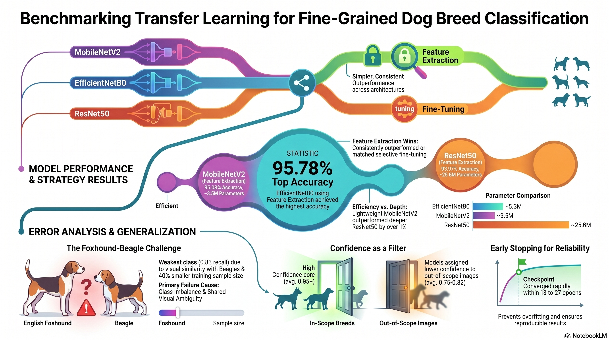

# 🐕 Dog Breed Classifier — 10-Class Transfer Learning Study

**Guilherme Sonego Neto** · Dundalk Institute of Technology · Postgraduate Diploma in Applied Data Science · May 2026

---

  

## Overview

An end-to-end machine-learning pipeline for classifying 10 visually similar dog breeds using the [Imagewoof](https://github.com/fastai/imagenette) dataset. The project compares three pre-trained CNN architectures under both **feature extraction** and **fine-tuning** strategies using TensorFlow/Keras, producing reproducible results and a deployable inference app.

## Key Results

| Model | Strategy | Test Accuracy |
|---|---|---|
| **EfficientNetB0** | Feature Extraction | **95.78%** |
| MobileNetV2 | Feature Extraction | 95.09% |
| ResNet50 | Feature Extraction | 93.97% |

> Fine-tuning did not consistently improve over feature-extraction baselines for any architecture.

---

  

---

## Stack

`Python` · `TensorFlow / Keras` · `Jupyter Notebook` · `NumPy` · `Pandas` · `Matplotlib` · `Seaborn` · `Streamlit`

## Repository Contents

| Path | Description |
|---|---|
| `Dog_Breed_Training_Experiments.ipynb` | Full training and evaluation notebook |
| `results/` | Per-model metrics, confusion matrices, and saved weights |
| `web_application/` | Streamlit inference app and runbook |
| `overleaf/` | LaTeX source for the dissertation report |

